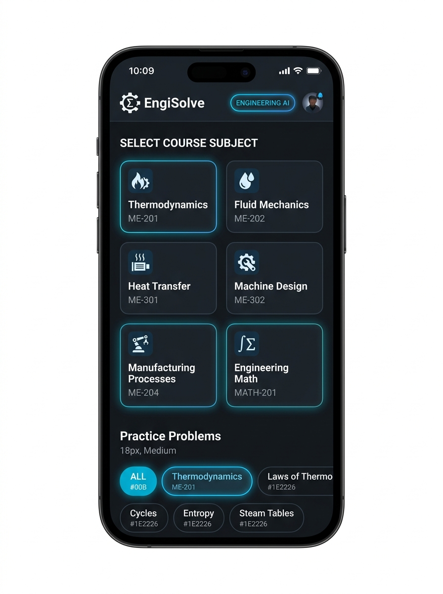
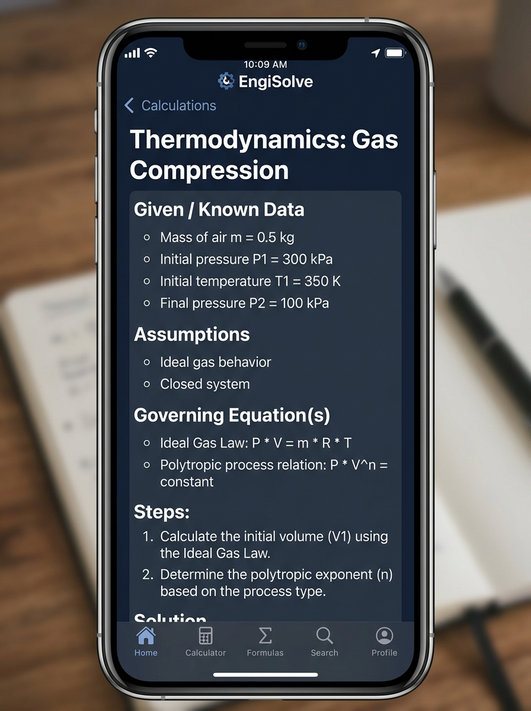
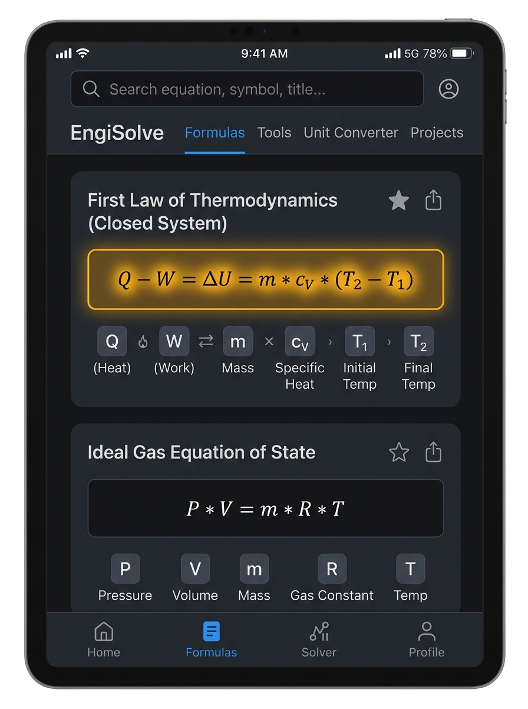
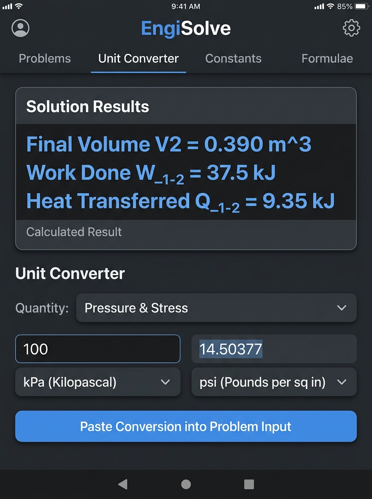

# EngiSolve — AI Study & Problem-Solving Assistant for Mechanical Engineering Students

**Live Application:** [EngiSolve Applet](https://ais-dev-ymyixqfcdhtj7c2jtpmhbf-271435965849.asia-east1.run.app)  

---

## a. Pitch & Overview

Mechanical engineering students juggle 5–6 dense subjects at once (Thermodynamics, Fluid Mechanics, Heat Transfer, Machine Design, Manufacturing Processes, and Engineering Math) with no single place to get step-by-step worked solutions when stuck on numerical problems at 1 AM. Generic AI chatbots output unstructured, unverified, and inconsistent engineering answers without unit checks or standardized methods. 

**EngiSolve** solves this by enforcing the exact 6-part problem-solving methodology expected by engineering professors: **Given → Assumptions → Governing Equation(s) → Solution Steps → Units Check → Final Answer**. It provides a single-destination study hub complete with a subject-tagged solution history and an interactive formula & unit converter reference panel.

---

## b. Deployed Live URL

- **Live URL:** [EngiSolve Application](https://ais-dev-ymyixqfcdhtj7c2jtpmhbf-271435965849.asia-east1.run.app)

---

## c. Full Features List

- **Subject Picker:** Quick navigation across core courses: Thermodynamics, Fluid Mechanics, Heat Transfer, Machine Design, Manufacturing Processes, and Engineering Math.
- **Problem Input & Sample Practice Launcher:** Flexible input area supporting custom pasted numerical problems and 18 pre-loaded practice problems (3 per subject) with difficulty indicators.
- **AI Structured Solver:** Server-side API integration enforcing standardized professor-grade solution formatting with low-temperature deterministic reasoning.
- **Solution History Panel:** Automatically saves solved problems into local browser storage with subject tags, timestamp, star favorites, keyword search, and one-click reopening.
- **Quick Formula Reference & Unit Converter:**
  - **Formula Sheet:** Interactive key equations per subject with variable definitions and standard SI/Imperial units.
  - **Unit Converter:** Live converter for Pressure, Power, Energy, Temperature, Dynamic Viscosity, Mass Flow, Density, and Torque.
- **Export & Copy Utility:** One-click formatted clipboard copy and Markdown file download.
- **System Prompt Inspector:** In-app transparency modal allowing students and judges to inspect the exact PRD system prompt and backend architecture.

---

## d. The AI Feature & System Prompt

EngiSolve uses a server-side Express proxy calling the Gemini API (`@google/genai` SDK) to ensure API keys are never exposed to the client. The AI tutor is governed by a strict system prompt that enforces academic structure and unit checks.

### System Prompt (Exact PRD Specification):

```text
You are EngiSolve, an expert mechanical engineering tutor. A student will give you
a problem statement and the subject it belongs to (Thermodynamics, Fluid Mechanics,
Heat Transfer, Machine Design, Manufacturing Processes, or Engineering Math).

Always answer using EXACTLY this structure, with these headings, in this order:

**Given / Known Data**
- List every value provided in the problem with units.

**Assumptions**
- State any standard engineering assumptions needed to solve it (e.g., ideal gas,
  steady state, negligible friction) — only if relevant. If none are needed, say
  "No additional assumptions required."

**Governing Equation(s)**
- Name and write the relevant equation(s) in standard engineering notation.

**Solution Steps**
- Solve step by step, showing substitution of values and intermediate results.
  Keep units attached at every step.

**Units Check**
- Briefly confirm the final answer's units are dimensionally correct.

**Final Answer**
- State the final numeric result clearly, bolded, with correct units and
  appropriate significant figures.

Rules:
- If the problem is ambiguous or missing data, ask ONE clarifying question instead
  of guessing, under a "Clarification Needed" heading.
- If it's a conceptual (non-numeric) question, skip Units Check and answer with
  Given/Context, Explanation, and Key Takeaway instead.
- Be concise but complete — no filler, no repeating the question back verbatim.
- Never fabricate formulas; if unsure, say so explicitly rather than guessing.
```

---

## e. Sample Benchmark Worked Solution (AI Output Reference)

Below is an exact benchmark output produced by EngiSolve for verifying AI tutor accuracy and plain-text mathematical formatting:

### Problem Statement:
> A rigid cylinder contains 0.5 kg of Air initially at P1 = 300 kPa and T1 = 350 K. The air undergoes a polytropic expansion with n = 1.3 to a final pressure of P2 = 100 kPa. Calculate the final volume, final temperature T2, the work done W_1-2, and heat transferred Q_1-2 during the process. Assume Air R = 0.287 kJ/kg·K and cv = 0.718 kJ/kg·K.

### Worked Solution Output:

```text
Given / Known Data
- Mass of air, m = 0.5 kg
- Initial pressure, P1 = 300 kPa
- Initial temperature, T1 = 350 K
- Final pressure, P2 = 100 kPa
- Polytropic exponent, n = 1.3
- Gas constant for air, R = 0.287 kJ/kg·K
- Specific heat at constant volume, cv = 0.718 kJ/kg·K

Assumptions
- Air behaves as an ideal gas with constant specific heats.
- The system is closed and undergoes a quasi-equilibrium polytropic expansion process.
- Boundary work is the only work interaction present.

Governing Equation(s)
- Ideal Gas Equation of State: P * V = m * R * T
- Polytropic Temperature-Pressure Relation: T2 / T1 = (P2 / P1)^((n - 1) / n)
- Boundary Work for a Polytropic Process: W_1-2 = (m * R * (T1 - T2)) / (n - 1)
- Internal Energy Change: delta_U = m * cv * (T2 - T1)
- First Law of Thermodynamics: Q_1-2 = delta_U + W_1-2

Solution Steps

1. Calculate Final Temperature (T2):
   Using the temperature-pressure relation for a polytropic process:
   T2 = T1 * (P2 / P1)^((n - 1) / n)
   T2 = 350 K * (100 kPa / 300 kPa)^((1.3 - 1) / 1.3)
   T2 = 350 K * (0.3333)^(0.2308)
   T2 = 350 K * 0.7762 = 271.67 K

2. Calculate Final Volume (V2):
   First, find the initial volume (V1):
   V1 = (m * R * T1) / P1
   V1 = (0.5 kg * 0.287 kJ/kg·K * 350 K) / 300 kPa = 0.1674 m^3

   Now, find the final volume (V2) using the ideal gas equation at state 2:
   V2 = (m * R * T2) / P2
   V2 = (0.5 kg * 0.287 kJ/kg·K * 271.67 K) / 100 kPa = 0.3898 m^3

3. Calculate Work Done (W_1-2):
   W_1-2 = (m * R * (T1 - T2)) / (n - 1)
   W_1-2 = (0.5 kg * 0.287 kJ/kg·K * (350 K - 271.67 K)) / (1.3 - 1)
   W_1-2 = (0.1435 kJ/K * 78.33 K) / 0.3
   W_1-2 = 11.2404 kJ / 0.3 = 37.47 kJ

4. Calculate Heat Transferred (Q_1-2):
   First, calculate change in internal energy (delta_U):
   delta_U = m * cv * (T2 - T1)
   delta_U = 0.5 kg * 0.718 kJ/kg·K * (271.67 K - 350 K)
   delta_U = 0.359 kJ/K * (-78.33 K) = -28.12 kJ

   Now, apply the First Law of Thermodynamics:
   Q_1-2 = delta_U + W_1-2
   Q_1-2 = -28.12 kJ + 37.47 kJ = 9.35 kJ

Units Check
- Volume: (kg * (kJ/kg·K) * K) / kPa = kJ / kPa = (kPa·m^3) / kPa = m^3 (Correct)
- Temperature: K (Correct)
- Work: kg * (kJ/kg·K) * K = kJ (Correct)
- Heat: kJ + kJ = kJ (Correct)

Final Answer
- Final Temperature, T2 = 271.7 K
- Final Volume, V2 = 0.390 m^3
- Work Done, W_1-2 = 37.5 kJ
- Heat Transferred, Q_1-2 = 9.35 kJ
```

---

## e. Tools & Tech Stack Used

- **Frontend Framework:** React 19, TypeScript, Vite
- **Styling:** Tailwind CSS v4, Lucide Icons, Motion
- **Backend Architecture:** Node.js, Express, ESBuild, TSX
- **AI SDK & Model:** `@google/genai` with `gemini-3.6-flash` (Server-side proxy route `/api/solve`)
- **Formatting & Rendering:** `react-markdown` and `katex`
- **Persistence:** LocalStorage

---

## f. Application Screenshots & Interface Highlights

### 1. Course Subject Selection & Practice Problems Launcher

- **Course Subject Selection:** Choose from 6 core mechanical engineering disciplines (Thermodynamics, Fluid Mechanics, Heat Transfer, Machine Design, Manufacturing Processes, Engineering Math).
- **Practice Problems Launcher:** Quick-start preset problems tailored to each subject.

### 2. Structured AI Worked Solution (6-Part Standard Output)

- **Professor-Grade 6-Part Layout:** Formatted strictly with **Given / Known Data**, **Assumptions**, **Governing Equation(s)**, **Solution Steps**, **Units Check**, and bolded **Final Answer**.

### 3. Interactive Formula Sheet & Equation Inspector

- **Searchable Formula Sheet:** Live searchable catalog of engineering equations, complete with parameter descriptions and interactive calculation evaluators.

### 4. Real-time Unit Converter Tool

- **Multi-Quantity Unit Converter:** Seamlessly converts units for pressure, stress, energy, viscosity, temperature, and mass flow rate with one-click injection into problem inputs.


---

## g. How to Run Locally

1. **Clone the repository:**
   ```bash
   git clone <repository-url>
   cd engisolve
   ```

2. **Install dependencies:**
   ```bash
   npm install
   ```

3. **Configure Environment Variables:**
   Create a `.env` file in the project root:
   ```env
   GEMINI_API_KEY="your-gemini-api-key"
   ```

4. **Start the Development Server:**
   ```bash
   npm run dev
   ```
   Open `http://localhost:3000` in your browser.

5. **Production Build:**
   ```bash
   npm run build
   npm start
   ```

---

## h. Deploying to Vercel

EngiSolve is pre-configured for seamless 1-click or CLI deployment on **Vercel**.

### Vercel Project Configuration
- **Framework Preset:** Vite
- **Build Command:** `npm run build`
- **Output Directory:** `dist`
- **Serverless API Route:** `/api/solve.ts` (Vercel automatically provisions Node.js serverless functions in the `/api` directory)

### Steps to Deploy on Vercel:

1. **Push your code to GitHub / GitLab / Bitbucket**:
   ```bash
   git add .
   git commit -m "Deploy EngiSolve to Vercel"
   git push origin main
   ```

2. **Import Project into Vercel Dashboard**:
   - Go to [Vercel Dashboard](https://vercel.com/new).
   - Select your `engisolve` repository.
   - Vercel will automatically detect `vite` and load configuration from `vercel.json`.

3. **Configure Environment Variables**:
   In the Vercel **Environment Variables** panel during setup (or under *Project Settings -> Environment Variables*), add:
   - **Key:** `GEMINI_API_KEY`
   - **Value:** `your_gemini_api_key_here`

4. **Deploy**:
   - Click **Deploy**.
   - Vercel will build the Vite frontend into `dist/` and expose `/api/solve` as a secure backend serverless endpoint.

