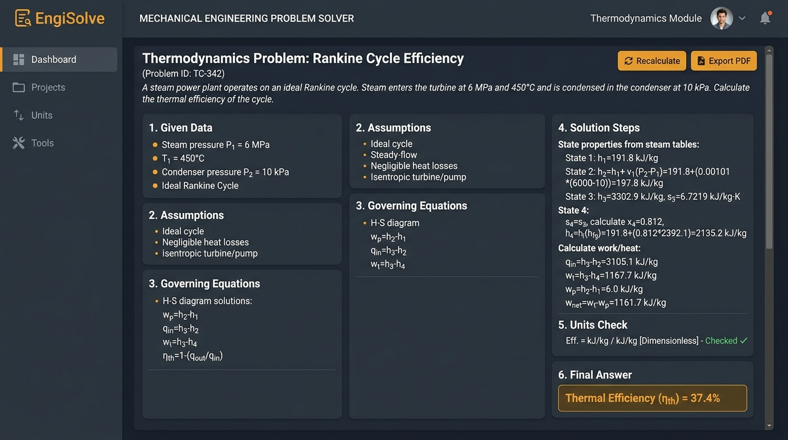
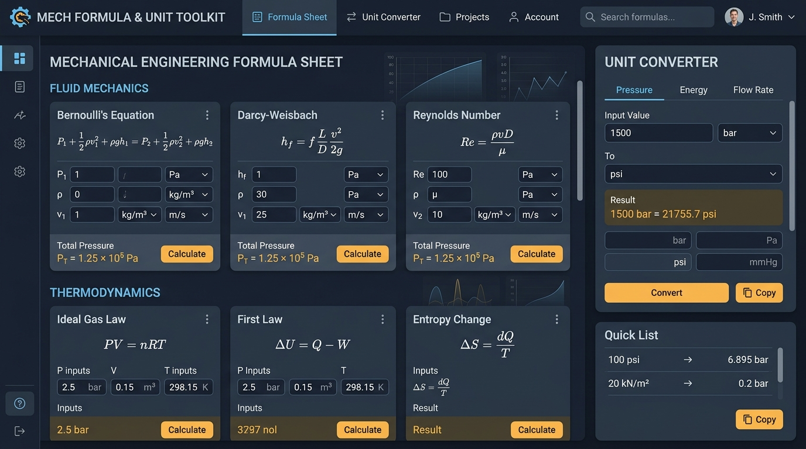

# EngiSolve — AI Study & Problem-Solving Assistant for Mechanical Engineering Students

**Live Application:** [EngiSolve Applet](https://ais-dev-ymyixqfcdhtj7c2jtpmhbf-271435965849.asia-east1.run.app)  
**Author:** 3rd semester Mechanical Engineering Student  
**Deadline:** Mon 27 July 2026, 11:59 PM PKT

---

## a. Pitch & Overview

Mechanical engineering students juggle 5–6 dense subjects at once (Thermodynamics, Fluid Mechanics, Heat Transfer, Machine Design, Manufacturing Processes, and Engineering Math) with no single place to get step-by-step worked solutions when stuck on numerical problems at 1 AM. Generic AI chatbots output unstructured, unverified, and inconsistent engineering answers without unit checks or standardized methods. 

**EngiSolve** solves this by enforcing the exact 6-part problem-solving methodology expected by engineering professors: **Given → Assumptions → Governing Equation(s) → Solution Steps → Units Check → Final Answer**. It provides a single-destination study hub complete with a subject-tagged solution history and an interactive formula & unit converter reference panel.

---

## b. Deployed Live URL

- **Live URL:** [EngiSolve Application](https://ais-dev-ymyixqfcdhtj7c2jtpmhbf-271435965849.asia-east1.run.app)
- **Shared URL:** [EngiSolve Public Shared Link](https://ais-pre-ymyixqfcdhtj7c2jtpmhbf-271435965849.asia-east1.run.app)

---

## c. Full Features List

- **Subject Picker:** Quick navigation across core courses: Thermodynamics, Fluid Mechanics, Heat Transfer, Machine Design, Manufacturing Processes, and Engineering Math.
- **Problem Input & Sample Practice Launcher:** Flexible input area supporting custom pasted numerical problems and 18 pre-loaded practice problems (3 per subject) with difficulty indicators.
- **AI Structured Solver:** Server-side API integration enforcing standardized professor-grade solution formatting with low-temperature deterministic reasoning.
- **Solution History Panel:** Automatically saves solved problems into local browser storage with subject tags, timestamp, star favorites, keyword search, and one-click reopening.
- **Quick Formula Reference & Unit Converter:**
  - **Formula Sheet:** Interactive key equations per subject with variable definitions and standard SI/Imperial units.
  - **Unit Converter:** Live converter for Pressure, Power, Energy, Temperature, Dynamic Viscosity, Mass Flow, Density, and Torque.
- **Export & Copy Utility:** One-click formatted clipboard copy and Markdown file download.
- **System Prompt Inspector:** In-app transparency modal allowing students and judges to inspect the exact PRD system prompt and backend architecture.

---

## d. The AI Feature & System Prompt

EngiSolve uses a server-side Express proxy calling the Gemini API (`@google/genai` SDK) to ensure API keys are never exposed to the client. The AI tutor is governed by a strict system prompt that enforces academic structure and unit checks.

### System Prompt (Exact PRD Specification):

```text
You are EngiSolve, an expert mechanical engineering tutor. A student will give you
a problem statement and the subject it belongs to (Thermodynamics, Fluid Mechanics,
Heat Transfer, Machine Design, Manufacturing Processes, or Engineering Math).

Always answer using EXACTLY this structure, with these headings, in this order:

**Given / Known Data**
- List every value provided in the problem with units.

**Assumptions**
- State any standard engineering assumptions needed to solve it (e.g., ideal gas,
  steady state, negligible friction) — only if relevant. If none are needed, say
  "No additional assumptions required."

**Governing Equation(s)**
- Name and write the relevant equation(s) in standard engineering notation.

**Solution Steps**
- Solve step by step, showing substitution of values and intermediate results.
  Keep units attached at every step.

**Units Check**
- Briefly confirm the final answer's units are dimensionally correct.

**Final Answer**
- State the final numeric result clearly, bolded, with correct units and
  appropriate significant figures.

Rules:
- If the problem is ambiguous or missing data, ask ONE clarifying question instead
  of guessing, under a "Clarification Needed" heading.
- If it's a conceptual (non-numeric) question, skip Units Check and answer with
  Given/Context, Explanation, and Key Takeaway instead.
- Be concise but complete — no filler, no repeating the question back verbatim.
- Never fabricate formulas; if unsure, say so explicitly rather than guessing.
```

---

## e. Tools & Tech Stack Used

- **Frontend Framework:** React 19, TypeScript, Vite
- **Styling:** Tailwind CSS v4, Lucide Icons, Motion
- **Backend Architecture:** Node.js, Express, ESBuild, TSX
- **AI SDK & Model:** `@google/genai` with `gemini-3.6-flash` (Server-side proxy route `/api/solve`)
- **Formatting & Rendering:** `react-markdown` and `katex`
- **Persistence:** LocalStorage

---

## f. Application Screenshots & Interface Highlights

### 1. Main EngiSolve Workspace & Structured AI Worked Solution

- **Subject Picker & Practice Launcher:** Select any of the 6 core mechanical engineering subjects to load subject-specific sample problems.
- **Professor-Grade 6-Part Solution Layout:** Features Given Data, Assumptions, Governing Equations, Step-by-Step Calculation with attached units, Units Check, and bolded Final Answer.

### 2. Interactive Formula Sheet & Unit Converter Sidebar

- **Interactive Formula Sheet:** Comprehensive equations across Thermodynamics, Fluid Mechanics, Heat Transfer, Machine Design, Manufacturing, and Engineering Math.
- **Integrated Unit Converter:** Live conversion between SI and Imperial units for pressure, energy, viscosity, temperature, and mass flow rate.


---

## g. How to Run Locally

1. **Clone the repository:**
   ```bash
   git clone <repository-url>
   cd engisolve
   ```

2. **Install dependencies:**
   ```bash
   npm install
   ```

3. **Configure Environment Variables:**
   Create a `.env` file in the project root:
   ```env
   GEMINI_API_KEY="your-gemini-api-key"
   ```

4. **Start the Development Server:**
   ```bash
   npm run dev
   ```
   Open `http://localhost:3000` in your browser.

5. **Production Build:**
   ```bash
   npm run build
   npm start
   ```
